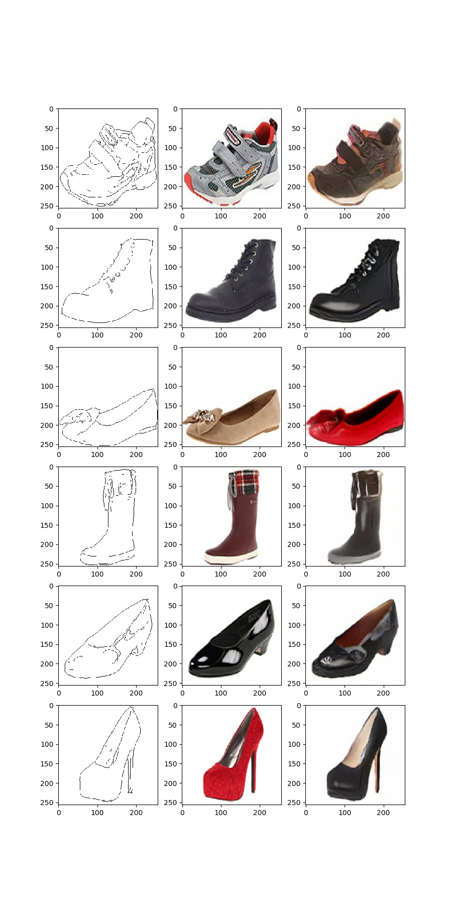

# pix2pix
Implementation of Pix2Pix in Pytorch
# Lighting-Swap-Cyclegan
This is an implementation of Pix2Pix based on this paper(https://arxiv.org/pdf/1611.07004)

The dataset I've done my first test with is edges2shoes: https://people.eecs.berkeley.edu/~tinghuiz/projects/pix2pix/datasets/edges2shoes.tar.gz

# Code usage

Usage instructions found here: [user manual page](USAGE.md).

# Example Results
## Edges2Shoes

