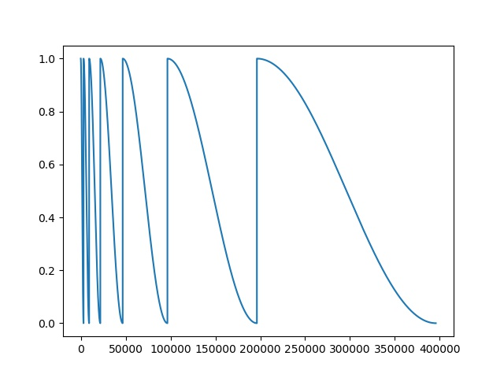
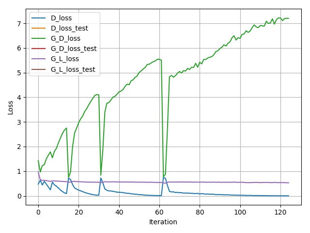

## Getting Started
- Install torch and dependencies from https://github.com/torch/distro
- Install packages 'tqdm', 'PIL', 'matplotlib', 'tar'

- Clone this repo:
```bash
git clone https://github.com/NeuralVFX/pix2pix.git
cd pix2pix
```
- Download the dataset (e.g. [edges2shoes](https://people.eecs.berkeley.edu/~tinghuiz/projects/pix2pix/datasets/edges2shoes.tar.gz)):
```bash
bash data/get_test_dataset.sh
```

## Train The Model
```bash
python train.py --dataset edges2shoes --train_epoch 5  --save_root shoes 
```

## Continue Training Existing Saved State
```bash
python train.py --dataset edges2shoes --train_epoch 5  --save_root shoes  --load_state output/shoes_3.json
```

## Command Line Arguments

```
--dataset default='edges2shoes', type=str                 # Dataset folder name
--train_folder', default='train', type=str                # Train folder name
--test_folder, default='val', type=str                    # Test folder name
--in_channels', default=3, type=int                       # Channels in image
--batch_size, default=16, type=int                        # Training batch size
--gen_filters, default=1024, type=int                     # Filter count for generators
--disc_filters, default=512, type=int                     # Filter count for discrimintors
--img_output_size, default=256, type=int                  # Image Training Size (Image is resized to this value in dataloader)
--gen_layers, default=6, type=int                         # Count of convolution and transpose layers in generator
--disc_layers, default=4, type=int                        # Count of layers in patch discriminator
--test_perc, default=1.0, type=float                      # Train on a subset of the training set, if set to 1 uses whole dataset
--lr_disc, default=1e-4, type=float                       # Learning rate for discriminator
--lr_gen, default=1e-4, type=float                        # Learning rate for generator
--lr_cycle_mult, default=2.0, type=float                  # Multiplier for number of iterations used in cosine anealing after each warm restart
--beta1, default=.5, type=float                           # Beta1 value used by optimzers
--beta2, default=.999, type=float                         # Beta2 value used by optimzers
--alpha, default=10, type=float                           # Multiplier for how much L1 loss to use
--train_epoch, default=6, type=int                        # Number of "warm restarts" before training completes
--ids, default=[10, 20], type=int                         # Ids which will be indexed into to generate preview images from the validation set
--save_root, default=shoes', type=str                     # Prefix for files created by the model under the /output directory
--load_state, type=str                                    # Optional: filename of state to load and resume training from
```

## Data Folder Structure

- This is the folder layout that the data is expected to be in:

`data/<data set>/<set type>/`

- For example if you are converting edges to shoes using `edges2shoes` training set:

Train Dir:

`data/shoes/train/`

Test Dir:

`data/shoes/val/`

## Output Folder Structure

- `weights`, `test images`, `loss graph` and `learning rate graph`, are all output to this directory: `output/<save_root>_*.*`

- Learning Rate Graph Example: `output/shoes_learning_rate_schedule.jpg`


- Loss Graph Example: `output/shoes_loss.jpg`


- Test Image Example (output every loop through dataset): `output/shoes_255.jpg`


## Other Notes

- This network is using `Warm Restarts` https://arxiv.org/pdf/1608.03983 , every `train_epoch` is a warm restart
